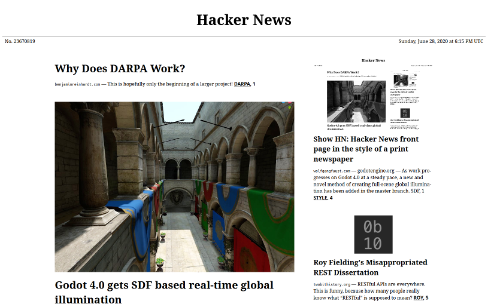

# [Paper HN](https://www.wolfgangfaust.com/project/paper-hn/)
Hacker News front page in the style of a print newspaper.



## How to run
```
yarn install
mkdir -p cache/hn/item cache/url
node ./bin/generate-html.mjs
```
This will create an `index.html` file which you can view. 

To automatically regenerate the output as you make changes:
```
yarn run watch
```

To update the list of stories on the front page:
```
rm cache/hn/*.json
```
